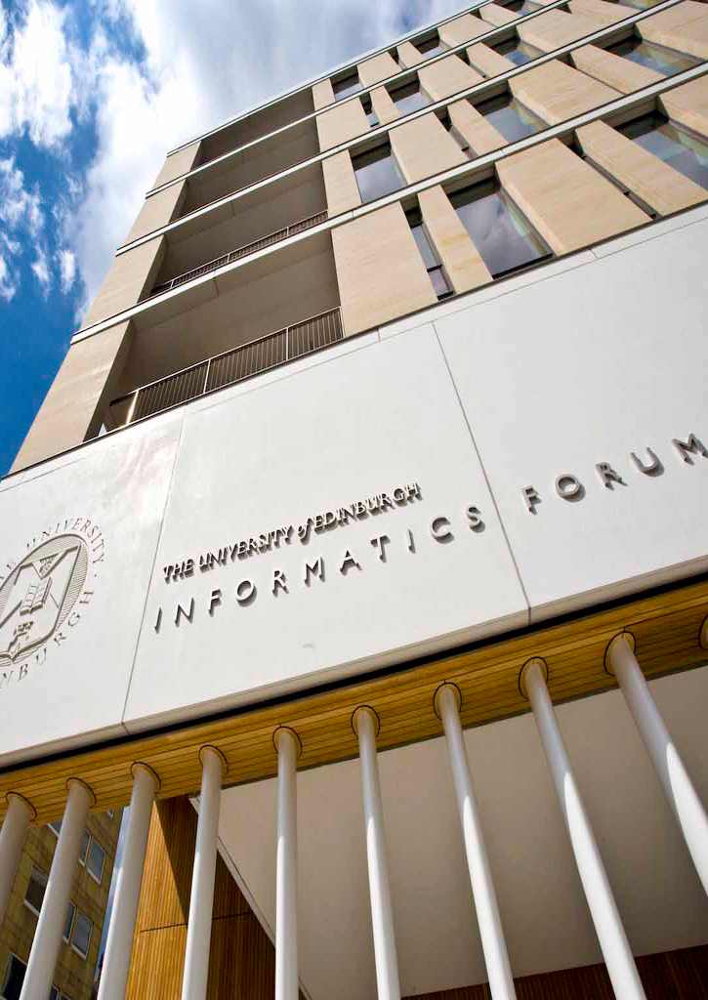

  

    

      
    

    

      
    

    

      
    

  

 
  Our group focuses on computational systems analyses of biological processes. We use mechanistic computational models 
to integrate heterogenous data into predictive models. We have a particular interest in mechanisms that promote the 
emergence and spread of antimicrobial resistance, which we study at the cellular and population level as well as across 
patients.    
  We are an interdisciplinary group led by <a href="/people/andreaWeisse/">Andrea Weiße</a>. Our expertise ranges from 
biology and biochemistry to bioinformatics, mathematics and machine learning. This is why we are lucky to be located at 
both the <a href="https://www.ed.ac.uk/biology">School of Biological Sciences</a> and the <a 
href="https://www.ed.ac.uk/informatics/">School of Informatics</a>, and also to be members of the <a 
href="https://www.ed.ac.uk/biology/centre-engineering-biology">Centre for Engineering Biology</a>.    

